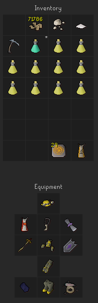
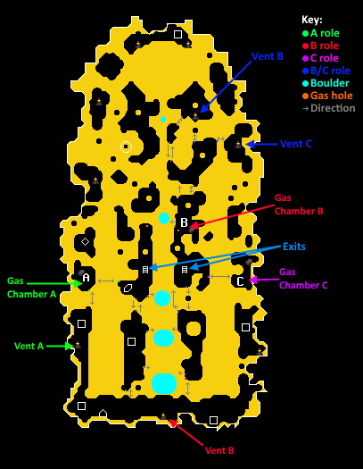

# VM Resources
A complete set of condensed reference material for learning Volcanic Mine in OSRS
Not a complete guide, intended to be used in conjunction with a experienced teachers

### Basic Requirements
- 50 Mining
- 150 Museum Kudos
- Have built the Fossil Island Museum Camp
- The "Ultimate Volcanic Mine" plugin from plugin hub
- Import the tile markers from the  section

### Gear Setup
The goals for gear are XP bonus and prayer bonus, balance and replace gear based on needs and availability.

Prayer level & bonus for 9:30 of protect range (Set quick prayer to protect range)
- 7:30 is also fine, but you will have to manage your prayer manually a little bit & bring a spare prayer potion for emergencies
- Alternatively replace prospector with Proselyte for easy mode prayer
- _*Seven (7) free inventory slots!*_
- If you can buy/afford to use brews, replace the karambwans with them
- Regen bracelet is nice to have but not required
- If you can afford the loss of prayer bonus, HP Cape > Ardy Cape
- Replace Stole with whatever your BiS prayer bonus item is
- Falador Shield(4) can act as your emergency prayer potion, though Holy Books (finished or not) and Broodoo Shields are all just as good (+5)
- A quick way to restore HP/Prayer (Pool & House Teles/Con Cape, Desert Amulet 4, Ferox Tele etc.)
- Numulite is for entering the mine, 30 is required to start, you will profit over time
- *Keep a few VM teletabs in your bank in case of death!*
- Auto retaliate _off!_



### General Pathing
A bulk of learning VM is learning how to path around and get to the places you need to go.

Import the tile markers by copying the text below to your clipboard, right clicking your ingame World Map Orb and clicking "Import Ground Markers"
These will help remember where to lay down paths to get to where you need to go
```
[{"regionId":15262,"regionX":38,"regionY":19,"z":1,"color":"#FFFFFFFF"},{"regionId":15262,"regionX":37,"regionY":19,"z":1,"color":"#FFFFFFFF"},
{"regionId":15262,"regionX":37,"regionY":35,"z":1,"color":"#FFFFFFFF"},{"regionId":15262,"regionX":36,"regionY":35,"z":1,"color":"#FFFFFFFF"},{"regionId":15262,"regionX":36,"regionY":29,"z":1,"color":"#FFFFFFFF"},{"regionId":15262,"regionX":35,"regionY":61,"z":1,"color":"#FFFFFFFF"},
{"regionId":15262,"regionX":35,"regionY":60,"z":1,"color":"#FFFFFFFF"},{"regionId":15262,"regionX":35,"regionY":59,"z":1,"color":"#FFFFFFFF"},
{"regionId":15262,"regionX":27,"regionY":29,"z":1,"color":"#FFFFFFFF"},{"regionId":15262,"regionX":24,"regionY":35,"z":1,"color":"#FFFFFFFF"},
{"regionId":15262,"regionX":8,"regionY":41,"z":1,"color":"#FFFFFFFF"},{"regionId":15262,"regionX":19,"regionY":43,"z":1,"color":"#FFFFFFFF"},
{"regionId":15262,"regionX":26,"regionY":19,"z":1,"color":"#FFFFFFFF"},{"regionId":15262,"regionX":24,"regionY":38,"z":1,"color":"#FFFFFFFF"},
{"regionId":15262,"regionX":38,"regionY":16,"z":1,"color":"#FFFFFFFF"},{"regionId":15262,"regionX":11,"regionY":41,"z":1,"color":"#FFFFFFFF"},
{"regionId":15262,"regionX":27,"regionY":49,"z":3,"color":"#FFFFFFFF"},{"regionId":15262,"regionX":37,"regionY":49,"z":3,"color":"#FFFFFFFF"},
{"regionId":15262,"regionX":44,"regionY":45,"z":1,"color":"#FFFFFFFF"},{"regionId":15262,"regionX":27,"regionY":39,"z":1,"color":"#FFFFFFFF"},
{"regionId":15262,"regionX":52,"regionY":42,"z":1,"color":"#FFFFFFFF"},{"regionId":15262,"regionX":38,"regionY":42,"z":1,"color":"#FFFFFFFF"},
{"regionId":15262,"regionX":24,"regionY":16,"z":1,"color":"#FFFFFFFF"},{"regionId":15263,"regionX":40,"regionY":4,"z":1,"color":"#FFFFFFFF"},
{"regionId":15263,"regionX":46,"regionY":17,"z":1,"color":"#FFFFFFFF"},{"regionId":15263,"regionX":36,"regionY":3,"z":1,"color":"#FFFFFFFF"},
{"regionId":15263,"regionX":40,"regionY":6,"z":1,"color":"#FFFFFFFF"},{"regionId":15263,"regionX":34,"regionY":13,"z":1,"color":"#FFFFFFFF"},
{"regionId":15263,"regionX":33,"regionY":18,"z":1,"color":"#FFFFFFFF"},{"regionId":15263,"regionX":40,"regionY":18,"z":1,"color":"#FFFFFFFF"}]
```

The map shows the location of the important features inside VM, and the tile markers give a guide on where/how to path to them.
Where and when you need to path is based on your roll and covered in 



## Roles
A good first role to learn is the BCCF role

### Mine Basics
- The mine has 3 Vents (A, B & C) and 3 corresponding Chambers.
- Once a Vent has been checked, its status will be known for the until the 5:00 reset
- Vent status can range from 0% to 100%. If the corresponding Chamber is "blocked" the number will go up, and go down if the Chamber is unblocked
- A Chamber is considered "fixed" if it is heading towards 50%, i.e. it is above 50% and unblocked, or below 50% and blocked
- At the 5 minute mark the Vent statuses will be randomised and become unknown again
- The last rock (where a majority of point are earned) will deplete very quickly if not all players are mining it. If someone falls behind or swims: STOP MINING THE ROCK

### Trios & Quads
#### BCCF (B check, C fix) - Simple, good beginner role, lower XP/hr
- Start on the East side
- Path all the way south to B Vent and check it
- Mine rock until B/C places a platform, then join them on it and continue to mine
- At the 5 minute reset, B/C will check Vent C, fix C Chamber if required
- Last person to rock 4 places a new platform

In Quads this role splits into BC and CF. BC does only the B check part, CF does only the C fixing part.

In Quads BC starts on the west side and goes south to B Vent, then joins A when they arrive
#### B/C - Intermediate role, medium XP/hr
- Start on the East side
- Run North to B chamber and wait for BC to check Vent B. You may cap twice while waiting
- Leave B chamber fixed and run South, create a new tile at rock 1 when you arrive
- If stability drops below 100% at any point before and at 6:00, fix B Chamber (the plugin will notify you)
- At 5:25, path North to the North East C Vent. Ideally getting there before 5:00 to check it before the reset (50 points)
- Check Vent C a second time after the reset, then path to Vent B to the North West and check it
- Last person to rock 4 places a new platform
#### A - Critical role, more complex/situational awareness required, best XP/hr
- Start on the West side
- Path West to Gas Chamber A, pick up the rock, then path South to Vent A and check it
- Return to Chamber A, picking up another rock and capping until A Chamber is fixed and you are out of rocks
- Path South to rock 5 and begin mining
- If stability drops below 100% at any point before and at 6:00, fix A Chamber (the plugin will notify you)
- At 5:15 if stability is below 50%, head to A Vent and prepare to check and fix A after the reset
- If after the 5:00 reset there are three double digit drops in stability, flip A Chamber immediately
- If the stability is already low before reset, mine rock 4 from the West side to be able to flip A faster

### Duos
Duos combine elements from Trio BCCF and BC roles.
Though the tasks are familiar, it can be hard to swap between Duos and other team sizes due to how the responsibilities mix

#### Duo B
- Start on the East side
- Path all the way south to B Vent and check it
- Mine rock until Duo C places a platform, then join them on it and continue to mine
- At 5:25, path North to the North East C Vent. Ideally getting there exactly at 5:00
- Check Vent C after the reset, then path to Vent B to the North West and check it
- On the way back South fix B Chamber if required
- If after the 5:00 reset there are three double digit drops in stability, flip A Chamber immediately
- Last person to rock 4 places a new platform

#### Duo C
- Start on the East side
- Path East to C Chamber, then South to C Vent (not marked on map, follow the tile markers)
- Check C Vent and fix C Chamber accordingly, by now B will have checked B Vent
- Leave B chamber fixed and run South, create a new tile at rock 1 when you arrive
- If stability drops below 100% at any point before and at 6:00, fix B or C Chamber, whichever is worse (the plugin will notify you)
- At 5:00 after Duo B has checked the vents, fix C Chamber if required
- Last person to rock 4 places a new platform
